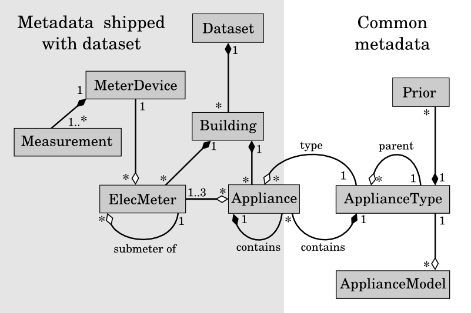
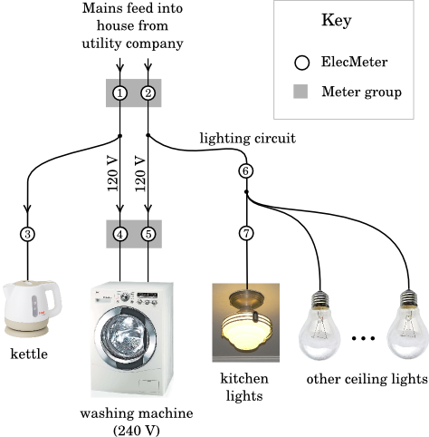

********************
NILM Metadata Manual
********************

UML Class Diagram showing the relationships between classes. A
dark black diamond indicates a ‘composition’ relationship whilst a hollow
diamond indicates an ‘aggregation’. For example, the relationship between
‘Dataset’ and ‘Building’ is read as ‘each Dataset contains any number of
Buildings and each Building belongs to exactly one Dataset’. We use hollow
diamonds to mean that objects of one class refer to objects in another class. For
example, each Appliance object refers to exactly one ApplianceType. Instances
of the classes in the shaded area on the left are intended to be shipped with each
dataset whilst objects of the classes on the right are common to all datasets and
are stored within the NILM Metadata project. Some ApplianceTypes contain
Appliances, hence the box representing the Appliance class slightly protrudes
into the ‘common metadata’ area on the right.

::

  # building1.yaml
  instance: 1
  elec_meters:
    1:
      site_meter: true,
      device_model: Whole-House Meter Model FOO
    2:
      site_meter: true,
      device_model: Whole-House Meter Model FOO
    3:
      submeter_of: 1
      device_model: Individual Appliance Monitor Model BAR
    4:
      submeter_of: 1
      device_model: Individual Appliance Monitor Model BAR
    5:
      submeter_of: 2
      device_model: Individual Appliance Monitor Model BAR
    6:
      submeter_of: 2
      device_model: Circuit Monitor Model BAZ
    7:
      submeter_of: 6
      device_model: Circuit Monitor Model BAZ

  appliances:
  - {type: kettle, instance: 1, room: kitchen, meters: [3]}
  - {type: washing machine, instance: 1, meters: [4,5]}
  - {type: light, instance: 1, room: kitchen, meters: [7]}
  - {type: light, instance: 2, multiple: true, meters: [6]}

