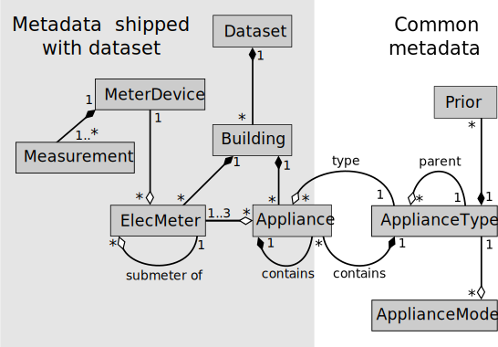

.. highlight:: yaml

**********************
NILM Metadata Tutorial
**********************

Before reading this tutorial, please make sure you have read the NILM
Metadata `README <https://github.com/nilmtk/nilm_metadata/blob/master/README.md>`_
which introduces the project.  Also, if you are not
familiar with YAML, please see the 
`WikiPedia page on YAML <http://en.wikipedia.org/wiki/YAML>`_ 
for a quick introduction.

NILM Metadata allows us to describe many of the objects we typically
find in a disaggregated energy dataset.  Below is a UML Class Diagram
showing all the classes and the relationships between classes:

A dark black diamond indicates a 'composition' relationship whilst a
hollow diamond indicates an 'aggregation'. For example, the
relationship between ``Dataset`` and ``Building`` is read as '*each
Dataset contains any number of Buildings and each Building belongs to
exactly one Dataset*'. We use hollow diamonds to mean that objects of
one class *refer* to objects in another class. For example, each
``Appliance`` object refers to exactly one
``ApplianceType``. Instances of the classes in the shaded area on the
left are intended to be shipped with each dataset whilst objects of
the classes on the right are common to all datasets and are stored
within the NILM Metadata project as the 'central metadata'. Some
``ApplianceTypes`` contain ``Appliances``, hence the box representing
the ``Appliance`` class slightly protrudes into the 'central metadata'
area on the right.

Below we will use examples to illustrate how to build a metadata
schema for a dataset.

Examples
========

Simple example
--------------

The illustration below shows a cartoon mains wiring diagram for
a domestic building. Black lines indicate mains wires. This home has a
split-phase mains supply (common in North America, for example). The
washing machine draws power across both splits. All other appliances
draw power from a single split.

.. image:: circuit_no_metadata.svg

The text below shows a minimalistic description (using the NILM
Metadata schema) of the wiring diagram above.  The YAML below
would go into the file :file:`building1.yaml`::

  instance: 1 # this is the first building in the dataset
  elec_meters: # a dictionary where each key is a meter instance
    1:
      site_meter: true # meter 1 measures the whole-building aggregate
    2:
      site_meter: true
    3:
      submeter_of: 1 # meter 3 is directly downstream of meter 1
    4:
      submeter_of: 1
    5:
      submeter_of: 2
    6:
      submeter_of: 2
    7:
      submeter_of: 6
  appliances:
  - {type: kettle, instance: 1, room: kitchen, meters: [3]}
  - {type: washing machine, instance: 1, meters: [4,5]}
  - {type: light, instance: 1, room: kitchen, meters: [7]}
  - {type: light, instance: 2, multiple: true, meters: [6]}

``elec_meters`` holds a dictionary of dictionaries.  Each key is a
meter instance (a unique integer identifier within the building).  We
start numbering from 1 because that is common in existing datasets.
Each value of the ``elec_meters`` dict is a dictionary recording
information about that specific meter (see the documentation on the
:ref:`elec-meter-schema` schema for full information). ``site_meter``
is set to ``true`` if this meter measures the whole-building aggregate
power demand. ``submeter_of`` records the meter instance of the
upstream meter.  In this way, we can specify wiring hierarchies of
arbitrary complexity.

``appliances`` is a list of dictionaries.  Each dictionary describes a
single appliance.  The appliance ``type`` (e.g. 'kettle' or 'washing
machine') is taken from a controlled vocabulary defined in NILM
Metadata.  See the :ref:`appliance-schema` schema for more information.

For each appliance, we must also specify an ``instance``
(an integer which, within each building, allows us to distinguish
between multiple instances of a particular appliance ``type``).  We
must also specify a list of ``meters``.  Each element in this list is
an integer which corresponds to a meter ``instance``.  In this way, we
can specify which meter is directly upstream of this appliance.  The
vast majority of domestic appliances will only specify a single meter.
We use two meters for north-American appliances which draw power from
both mains legs.  We use three meters for three-phase appliances.

See the documentation of the :doc:`dataset_metadata` for a full
listing of all elements which can be described, or continue below for
a more detailed example.

Representing REDD using NILM Metadata
-------------------------------------

The `Reference Energy Disaggregation Data set (REDD)
<http://redd.csail.mit.edu>`_ (`Kolter & Johnson 2011
<http://redd.csail.mit.edu/kolter-kddsust11.pdf>`_) was the first
public dataset to be released for the energy disaggregation community.
It consists of six homes.  Each home has its whole-home aggregate
power demand measured and also has its circuits measured.  REDD
provides both low frequency (3 second sample period) and high
frequency data.  We will only specify the low frequency data in this
example.

NILM Metadata can be specified as either YAML or as metadata within an
HDF5 binary file.  YAML is probably best for distribution with a
dataset.  HDF5 is used by `NILMTK <http://nilmtk.github.io>`_ to store
both the data itself and the metadata.  The data structures are very
similar no matter if the metadata is represented on disk as YAML or
HDF5.  The main difference is where the metadata is stored.  In this
example, we will only consider YAML.  The YAML files are stored in a
:file:`metadata` directory included with the dataset.  For details of
where this information is stored within HDF5, please see the relevant
sections of the :doc:`dataset_metadata` page.

First we will specify the details of the dataset, then details about
each building.

Dataset
^^^^^^^

We will use the :ref:`Dataset schema <dataset-schema>` to describe the name of
the dataset, authors, geographical location etc.  If you want to
create a minimal metadata description of a dataset then you don't need
to specify anything for the ``Dataset``.

This information would be stored in :file:`dataset.yaml`.

First, let us specify the name of the dataset and the creators::

  name: REDD
  long_name: The Reference Energy Disaggregation Data set
  creators:
  - Kolter, Zico
  - Johnson, Matthew
  publication_date: 2011
  institution: Massachusetts Institute of Technology (MIT)
  contact: zkolter@cs.cmu.edu   # Zico moved from MIT to CMU
  description: Several weeks of power data for 6 different homes.
  subject: Disaggregated power demand from domestic buildings.
  number_of_buildings: 6
  timezone: US/Eastern   # MIT is on the east coast
  geo_location:
    locality: Massachusetts   # village, town, city or state
    country: US   # standard two-letter country code defined by ISO 3166-1 alpha-2
    latitude: 42.360091 # MIT's coorindates
    longitude: -71.09416
  related_documents:
  - http://redd.csail.mit.edu
  - >
    J. Zico Kolter and Matthew J. Johnson. 
    REDD: A public data set for energy disaggregation research. 
    In proceedings of the SustKDD workshop on 
    Data Mining Applications in Sustainability, 2011.
    http://redd.csail.mit.edu/kolter-kddsust11.pdf
  schema: https://github.com/nilmtk/nilm_metadata/tree/v0.2

The nominal mains voltage can be inferred from the
``geo_location:country`` value.

Meter Devices
^^^^^^^^^^^^^

Next, we describe the common characteristics of each type of meter
used to record the data.  See the documentation section on
:ref:`meter-device-schema` for full details. You can think of this as
the 'specification sheet' supplied with each model of meter used to
record the dataset.  This information would be stored in
:file:`meter_devices.yaml`.

This data structure is one big dictionary.  Each key is a model name.
Each value is a dictionary describing the meter::

  eMonitor:
    model: eMonitor
    manufacturer: Powerhouse Dynamics
    manufacturer_url: http://powerhousedynamics.com
    description: >
      Measures circuit-level power demand.  Comes with 24 CTs.
      This FAQ page suggests the eMonitor measures real (active)
      power: http://www.energycircle.com/node/14103  although the REDD 
      readme.txt says all channels record apparent power.
    sample_period: 3   # the interval between samples. In seconds.
    max_sample_period: 50   # Max allowable interval between samples. Seconds.
    measurements:
    - physical_quantity: power   # power, voltage, energy, current?
      type: active   # active (real power), reactive or apparent?
      upper_limit: 5000
      lower_limit: 0
    wireless: false 

  REDD_whole_house:
    description: >
      REDD's DIY power meter used to measure whole-home AC waveforms
      at high frequency.  To quote from their paper: "CTs from TED
      (http://www.theenergydetective.com) to measure current in the
      power mains, a Pico TA041 oscilloscope probe
      (http://www.picotechnologies.com) to measure voltage for one of
      the two phases in the home, and a National Instruments NI-9239
      analog to digital converter to transform both these analog
      signals to digital readings. This A/D converter has 24 bit
      resolution with noise of approximately 70 µV, which determines
      the noise level of our current and voltage readings: the TED CTs
      are rated for 200 amp circuits and a maximum of 3 volts, so we
      are able to differentiate between currents of approximately
      ((200))(70 × 10−6)/(3) = 4.66mA, corresponding to power changes
      of about 0.5 watts. Similarly, since we use a 1:100 voltage
      stepdown in the oscilloscope probe, we can detect voltage
      differences of about 7mV."
    sample_period: 1
    max_sample_period: 30
    measurements:
    - physical_quantity: power
      type: apparent
      upper_limit: 50000
      lower_limit: 0
    wireless: false

Buildings, electricity meters and appliances
^^^^^^^^^^^^^^^^^^^^^^^^^^^^^^^^^^^^^^^^^^^^

Finally, we need to specify metadata for each building in the
dataset.  Information about each electricity meter and each appliance
is specified along with the building.  Metadata for each building goes
into :file:`building{<i>}.yaml` where *i* is an integer starting
from 1.  e.g. :file:`building1.yaml`

We will describe ``house_1`` from REDD.  First, we describe the basic
information about ``house_1`` using the :ref:`building-schema` schema::

  instance: 1   # this is the first building in the dataset
  original_name: house_1   # original name from REDD dataset
  elec_meters:   # see below
  appliances:   # see below

We do now know the specific geographical location of ``house_1`` in REDD.  As
such, we can assume that ``house_1`` will just 'inherit' 
``geo_location`` and ``timezone`` from the ``dataset`` metadata.  If we did
know the geographical location of ``house_1`` then we could specify it
in ``building1.yaml``.

Next, we specify every electricity meter and the wiring between the
meters using the :ref:`elec-meter-schema` schema.  ``elec_meters`` is
a dictionary.  Each key is a meter instance.  Each value is a
dictionary describing that meter.  To keep this short, we won't show
every meter::

  elec_meters:
    1:
      site_meter: true
      device_model: REDD_whole_house  # keys into meter_devices dictionary
      data_location: house_1/channel_1.dat
    2:
      site_meter: true
      device_model: REDD_whole_house
      data_location: house_1/channel_2.dat
    3:
      submeter_of: 0 # '0' means 'one of the site_meters'. We don't know
                     # which site meter feeds which appliance in REDD.
      device_model: eMonitor
      data_location: house_1/channel_3.dat
    4:
      submeter_of: 0
      device_model: eMonitor
      data_location: house_4/channel_4.dat

We could also specify attributes such as ``room, floor,
preprocessing_applied, statistics, upstream_meter_in_building`` but
none of these are relevant for REDD.

Now we can specify which appliances connect to which meters. 

For reference, here is the original :file:`labels.dat` for
:file:`house_1` in REDD::

  1 mains
  2 mains
  3 oven
  4 oven
  5 refrigerator
  6 dishwaser
  7 kitchen_outlets
  8 kitchen_outlets
  9 lighting
  10 washer_dryer
  11 microwave
  12 bathroom_gfi
  13 electric_heat
  14 stove
  15 kitchen_outlets
  16 kitchen_outlets
  17 lighting
  18 lighting
  19 washer_dryer
  20 washer_dryer

We use the :ref:`appliance-schema` schema to specify appliances.  In
REDD, all the meters measure *circuits* using CT clamps in the homes'
fuse box.  Some circuits deliver power to *individual* appliances.
Other circuits deliver power to *groups* of appliances.

``appliances`` is a list of dictionaries.

Let us start by demonstrating how we describe circuits which deliver
power to an individual appliance::

  appliances:

  - type: fridge
    instance: 1
    meters: [5]
    original_name: refrigerator

Recall from the `Simple example`_ that the value of appliance ``type``
is taken from the NILM Metadata controlled vocabulary of appliance
types.  ``original_name`` is the name used in REDD, prior to
conversion to the NILM Metadata controlled vocabulary.

Now we specify two 240-volt appliances.  North American homes have
split-phase mains supplies.  Each split is 120 volts relative to
neutral.  The two splits are 240 volts relative to each other.  Large
appliances can connect to both splits to draw lots of power.  REDD
separately meters both splits to these large appliances so we
specify two meters per 240-volt appliance::

  appliances:

  - type: electric oven
    instance: 1
    meters: [3, 4]   # the oven draws power from both 120 volt legs
    original_name: oven

  - original_name: washer_dryer
    type: washer dryer
    instance: 1
    meters: [10, 20]
    components: # we can specify which components connect to which leg
    - type: motor
      meters: [10]
    - type: electric heating element
      meters: [20]

Now we specify loads which aren't single appliances but, instead, are
categories of appliances::

  appliances:

  - original_name: kitchen_outlets
    room: kitchen
    type: sockets   # sockets is treated as an appliance
    instance: 1
    multiple: true   # likely to be more than 1 socket
    meters: [7]

  - original_name: kitchen_outlets
    room: kitchen
    type: sockets
    instance: 2   # 2nd instance of 'sockets' in this building
    multiple: true   # likely to be more than 1 socket
    meters: [8]

  - original_name: lighting
    type: light
    instance: 1
    multiple: true   # likely to be more than 1 light
    meters: [9]

  - original_name: lighting
    type: light
    instance: 2   # 2nd instance of 'light' in this building
    multiple: true
    meters: [17]

  - original_name: lighting
    type: light
    instance: 3   # 3rd instance of 'light' in this building
    multiple: true
    meters: [18]
 
  - original_name: bathroom_gfi   # ground fault interrupter
    room: bathroom
    type: unknown
    instance: 1
    multiple: true
    meters: [12]

Note that if we have multiple distinct instances of the same type of
appliance then we must use separate appliance objects for each
instance and must *not* bunch these together as a single appliance
object with multiple ``meters``.  We only specify multiple
``meters`` per ``appliance`` if there is a single appliance which
draws power from more than one phase or mains leg.

In REDD, houses 3, 5 and 6 also have an ``electronics`` channel.  How would we
handle this in NILM Metadata?  This is a meter which doesn't record a
single appliance but records a *category* of appliances.  Luckily,
because NILM Metadata uses an inheritance structure for the central
metadata, we already have a ``CE appliance`` (CE = consumer
electronics).  The ``CE appliance`` object was first built to
act as an abstract superclass for all consumer electronics
objects, but it comes in handy for REDD::

  - original_name: electronics
    type: CE appliance
    instance: 1
    multiple: true
    meters: [6]

The `full description of the REDD dataset using NILM Metadata can be
found in the NILMTK project
<https://github.com/nilmtk/nilmtk/tree/master/nilmtk/dataset_converters/redd/metadata>`_
along with the `metadata descriptions for many other datasets <https://github.com/nilmtk/nilmtk/tree/master/nilmtk/dataset_converters>`_.

Summary
-------

We have seen how to represent the REDD dataset using NILM Metadata.
The example above shows the majority of the *structure* of the NILM
Metadata schema for datasets.  There are many more attributes that can
be attached to this basic structure.  Please see the
:doc:`dataset_metadata` documentation for full details of all the
attributes and values that can be used.

Central Metadata
^^^^^^^^^^^^^^^^

A second part to the NILM Metadata project is the 'central metadata'.
This 'central metadata' is stored in the NILM Metadata project itself
and consists of information such as the mapping of appliance type to
appliance category; and the mapping of country code to nominal voltage
values.  Please see the documentation page on :doc:`central_metadata`
for more information.

Improving NILM Metadata
^^^^^^^^^^^^^^^^^^^^^^^

The NILM Metadata schema will, of course, never be complete enough to
cover every conceivable dataset!  You are warmly invited to suggest
changes and extensions.  You can do this either using the 
`github issue queue
<https://github.com/nilmtk/nilm_metadata/issues>`_,
or by `forking the project, modifying it and issuing a pull request 
<https://help.github.com/articles/fork-a-repo>`_.
